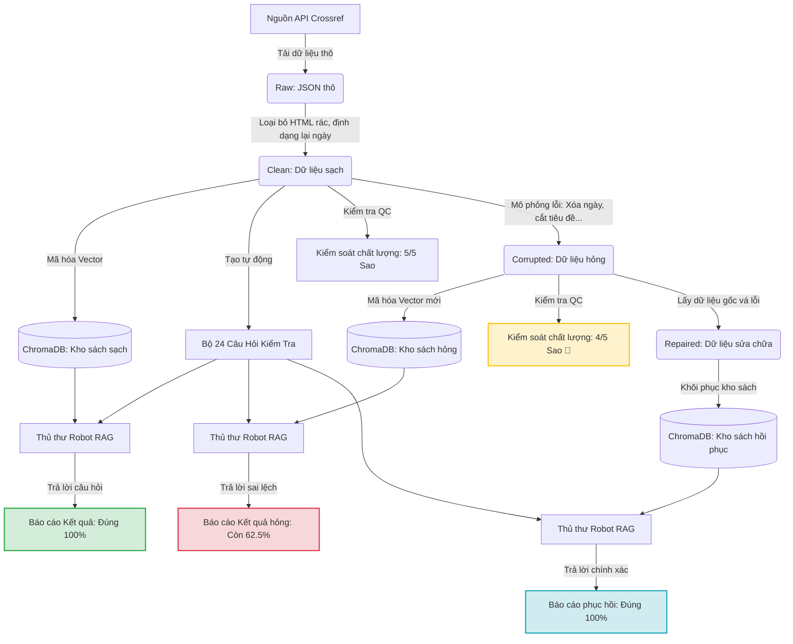

# Hướng Dẫn Vận Hành Đường Ống Dữ Liệu RAG & Giám Sát Chất Lượng (Dành Cho Người Mới Bắt Đầu)

Tài liệu này giải thích cách thức hoạt động của hệ thống xử lý dữ liệu phục vụ Trí tuệ Nhân tạo (RAG) và cách giám sát, sửa lỗi khi dữ liệu gặp sự cố. Chúng tôi sử dụng các hình ảnh ẩn dụ thực tế để bạn dễ dàng nắm bắt kể cả khi không có chuyên môn kỹ thuật.

---

## 📚 1. Các khái niệm cơ bản dưới góc nhìn thực tế

### 🤖 Hệ thống RAG (Retrieval-Augmented Generation) là gì?
*   **Ẩn dụ:** Hãy tưởng tượng bạn thuê một **Thủ thư Robot** để trả lời câu hỏi của khách hàng. Robot này rất thông minh nhưng không nhớ hết tất cả tri thức trên thế giới. 
*   **Cách hoạt động:** Khi khách hàng hỏi một câu, Robot sẽ chạy vào **Kho sách** của thư viện, tìm cuốn sách phù hợp nhất, đọc nhanh nội dung rồi tổng hợp lại câu trả lời chính xác cho khách.
*   **Vấn đề:** Nếu sách trong kho bị rách, bị tẩy xóa hoặc thông tin sai lệch, Robot chắc chắn sẽ trả lời sai.

### 🚰 Đường ông dữ liệu (Data Pipeline) là gì?
*   **Ẩn dụ:** Là quy trình **nhập khẩu, phân loại và sắp xếp sách** vào kho một cách tự động.
*   **Quy trình (ETL):** 
    1.  **E**xtract (Khai thác): Lấy sách thô từ nhà xuất bản.
    2.  **T**ransform (Dọn dẹp): Làm sạch bìa bụi, sửa lỗi in ấn, dán mã vạch.
    3.  **L**oad (Lưu kho): Xếp sách gọn gàng lên các kệ sách thông minh để robot dễ tìm.

### 🔍 Giám sát dữ liệu (Data Observability) là gì?
*   **Ẩn dụ:** Là **Bộ phận Kiểm soát Chất lượng (QC)** của thư viện. 
*   Bộ phận này sẽ kiểm tra xem: Sách có bị trùng lặp không? Có cuốn nào bị mất trang không? Sách có quá cũ không? Nếu phát hiện lỗi, họ sẽ phát tín hiệu cảnh báo.

---

## 🗺️ 2. Sơ đồ luồng hoạt động của hệ thống

Dưới đây là cách dữ liệu di chuyển từ nguồn bên ngoài qua các bộ lọc, vào cơ sở dữ liệu và được đánh giá:



---

## ⚙️ 3. Quy trình thực hiện chi tiết & Các chương trình tham chiếu

Dưới đây là các bước thực hiện của hệ thống kèm theo đường dẫn trực tiếp đến các file mã nguồn (code) chịu trách nhiệm cho từng nhiệm vụ:

### Pha 1: Tạo dựng cơ sở dữ liệu sạch (Baseline)
*   **Bước 1: Thu thập dữ liệu (Data Ingestion)**
    *   *Mô tả:* Tự động kết nối, tải danh sách bài báo khoa học thô từ nhà xuất bản mở và lưu trữ dữ liệu gốc.
    *   *Mã nguồn thực hiện:* [crossref.py](file:///Users/huyvo/Documents/VinAI/VinAI/Day-10-Data-Pipeline-Data-Observability/src/ingestion/crossref.py)
*   **Bước 2: Dọn dẹp & Tối ưu (Data Cleaning)**
    *   *Mô tả:* Loại bỏ HTML, chuẩn hóa thông tin tác giả, tiêu đề, tính độ tuổi bài báo để robot dễ xử lý.
    *   *Mã nguồn thực hiện:* [cleaning.py](file:///Users/huyvo/Documents/VinAI/VinAI/Day-10-Data-Pipeline-Data-Observability/src/ingestion/cleaning.py)
*   **Bước 3: Tạo mã vạch tìm kiếm (Embedding & Indexing)**
    *   *Mô tả:* Biến văn bản thành các vector số học và lưu trữ vào Vector Database để phục vụ tìm kiếm ngữ nghĩa siêu tốc.
    *   *Mã nguồn thực hiện:* [embeddings.py](file:///Users/huyvo/Documents/VinAI/VinAI/Day-10-Data-Pipeline-Data-Observability/src/retrieval/embeddings.py) (phần mô hình hóa) và [index.py](file:///Users/huyvo/Documents/VinAI/VinAI/Day-10-Data-Pipeline-Data-Observability/src/retrieval/index.py) (phần quản lý kho ChromaDB)
*   **Bước 4: Tạo bộ câu hỏi thi thử (Test Set Builder)**
    *   *Mô tả:* Soạn tự động 24 câu hỏi kiểm tra chia đều làm 4 chủ đề (Tóm tắt, Tác giả, Ngày tháng, Thể loại) từ chính dữ liệu bài báo.
    *   *Mã nguồn thực hiện:* [testset.py](file:///Users/huyvo/Documents/VinAI/VinAI/Day-10-Data-Pipeline-Data-Observability/src/evaluation/testset.py)
*   **Bước 5: Chạy thử nghiệm & Chấm điểm (Evaluation)**
    *   *Mô tả:* Cho Robot làm bài thi 24 câu, tính toán độ chính xác và khả năng tìm kiếm thông tin của mô hình RAG.
    *   *Mã nguồn thực hiện:* [metrics.py](file:///Users/huyvo/Documents/VinAI/VinAI/Day-10-Data-Pipeline-Data-Observability/src/evaluation/metrics.py)
*   **Bước 6: Kiểm soát chất lượng & Viết báo cáo (Observability)**
    *   *Mô tả:* Chạy 5 bài kiểm tra chất lượng dữ liệu (kiểm tra rỗng, trùng lặp, định dạng), tính toán độ mới (freshness) của dữ liệu và xuất báo cáo markdown trực quan.
    *   *Mã nguồn thực hiện:* [quality.py](file:///Users/huyvo/Documents/VinAI/VinAI/Day-10-Data-Pipeline-Data-Observability/src/observability/quality.py) và [reporting.py](file:///Users/huyvo/Documents/VinAI/VinAI/Day-10-Data-Pipeline-Data-Observability/src/observability/reporting.py)

➡️ **Bộ điều phối toàn bộ Pha 1:** [phase1.py](file:///Users/huyvo/Documents/VinAI/VinAI/Day-10-Data-Pipeline-Data-Observability/src/pipelines/phase1.py) là nơi gộp tất cả các bước trên thành một quy trình khép kín chạy từ đầu đến cuối.

---

### Pha 2: Gây lỗi thử thách & Tự động phục hồi (Corruption & Repair)
*   **Bước 1: Gây lỗi dữ liệu (Data Corruption)**
    *   *Mô tả:* Cố ý chèn rác, nhân bản dòng, xóa tóm tắt, chỉnh sửa ngày tháng để kiểm tra mức độ chống chịu lỗi của hệ thống.
    *   *Mã nguồn thực hiện:* [corruption.py](file:///Users/huyvo/Documents/VinAI/VinAI/Day-10-Data-Pipeline-Data-Observability/src/ingestion/corruption.py)
*   **Bước 2: Đo lường thiệt hại & Tự động sửa lỗi (Repair & Re-evaluation)**
    *   *Mô tả:* Cho Robot thi trên kho sách hỏng (ghi lại điểm số bị sụt giảm), sau đó chạy chương trình tự sửa (Repair) bằng cách tải đè lại dữ liệu sạch từ API, rồi kiểm tra lại.
    *   *Mã nguồn thực hiện:* Điều khiển trực tiếp bởi file luồng chính.

➡️ **Bộ điều phối toàn bộ Pha 2:** [corruption_flow.py](file:///Users/huyvo/Documents/VinAI/VinAI/Day-10-Data-Pipeline-Data-Observability/src/pipelines/corruption_flow.py) chịu trách nhiệm gây lỗi -> đánh giá -> tự động sửa chữa -> so sánh và xuất báo cáo đối chiếu.

---

## 🏃 4. Hướng dẫn cách khởi chạy chương trình

Bạn chỉ cần thực hiện 3 bước đơn giản sau trên máy tính của mình:

### Bước 1: Mở cửa sổ dòng lệnh (Terminal)
Di chuyển vào thư mục dự án của bạn trên máy Mac:
```bash
# Đảm bảo bạn đang ở thư mục: Day-10-Data-Pipeline-Data-Observability
```

### Bước 2: Cài đặt và cập nhật môi trường ảo
Sử dụng công cụ `uv` để chuẩn bị môi trường chạy siêu tốc:
```bash
uv sync
```

### Bước 3: Chạy các chương trình điều phối

> [!NOTE]
> Bạn không cần cấu hình thêm bất kỳ khóa bảo mật (API Key) nào vì hệ thống đã được tích hợp cơ chế chấm điểm tự động thông minh nội bộ.

*   **Để chạy thử nghiệm luồng dữ liệu sạch (Phase 1):**
    ```bash
    uv run python script/run_phase1.py
    ```
    *Lệnh này sẽ thực thi bộ điều phối [phase1.py](file:///Users/huyvo/Documents/VinAI/VinAI/Day-10-Data-Pipeline-Data-Observability/src/pipelines/phase1.py).*

*   **Để chạy thử nghiệm lỗi và khôi phục (Phase 2):**
    ```bash
    uv run python script/run_corruption_flow.py
    ```
    *Lệnh này sẽ thực thi bộ điều phối [corruption_flow.py](file:///Users/huyvo/Documents/VinAI/VinAI/Day-10-Data-Pipeline-Data-Observability/src/pipelines/corruption_flow.py).*

---

## 📊 5. Các thư mục kết quả cần theo dõi

Sau khi chạy xong, toàn bộ báo cáo sẽ nằm tại thư mục `data/` trong dự án của bạn:

*   📄 **Báo cáo Phase 1:** Mở tệp [phase1_report.md](file:///Users/huyvo/Documents/VinAI/VinAI/Day-10-Data-Pipeline-Data-Observability/data/reports/phase1_report.md) để xem chi tiết chất lượng dữ liệu ban đầu.
*   📊 **Báo cáo Đối chiếu Lỗi & Sửa lỗi:** Mở tệp [corruption_report.md](file:///Users/huyvo/Documents/VinAI/VinAI/Day-10-Data-Pipeline-Data-Observability/data/reports/corruption_report.md) để xem đồ thị so sánh điểm số trước và sau khi phục hồi dữ liệu.
*   💾 **Dữ liệu thô & Sạch:** Có thể kiểm tra các tệp tin lưu trữ dạng bảng biểu CSV/JSON trong thư mục `data/clean/` và `data/raw/`.
